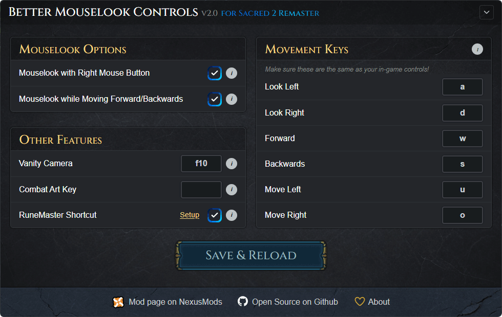

# Better Mouselook Controls for Sacred 2 Remaster

An AutoHotkey v2 script that adds mouselook and quality-of-life enhancements to Sacred 2 Remaster, with a user-friendly configurator.

  

## Features

- **Mouselook with Right Mouse Button** : hold the right mouse button to rotate the camera, enables strafe keys. Classic MMO-style controls.
- **Mouselook while Moving** : the camera follows your mouse automatically whenever you run forward or backward, so you can steer without holding any button. Easy on the wrists.
- **Vanity Camera** — similar to the idle camera in Skyrim that circles around your character. Toggle it on/off with a key (default **F10**) or **ESC**.
- **RuneMaster Shortcut** : moves runes from the inventory to the RuneMaster slot, no dragging required (this really should be in the game but hey).
- **Combat Art Key** : if you use Classic mouselook and NOT quickcast, then you need a key shortcut to activate combat arts.

Your settings are saved automatically and remembered the next time you launch.

## Links

- 🔗 [Mod page on NexusMods](https://www.nexusmods.com/sacred2remaster/mods/36)
- 👾 [Sacred 2 Remaster on Steam](https://store.steampowered.com/app/3906660/Sacred_2_Remaster/)

## For developers

Want to tinker with the code? Here's the setup used to build this.

**Stack:**

- AutoHotkey v2
- [WebViewToo](https://github.com/The-CoDingman/WebViewToo) (GUI)
- TailwindCSS
- vanilla JS
- No build step beyond Tailwind.

**Tools:**

- Git Bash (Git for Windows)
- VSCode with the AHK++ extension
- TailwindCSS standalone compiler (`tailwindcss -w -i gui/style.css -o gui/style.build.css`)
- *(optional)* Claude Code
